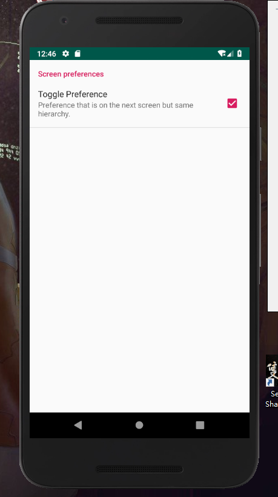

<h2 id="0"></h2> 

# 实验位置 
实验1位置:  [androidclass/helloworld/](https://github.com/SeanTong11/androiddev/tree/master/androidclass/helloworld/app)  
实验2位置:	[androidclass/exp2/](https://github.com/SeanTong11/androiddev/tree/master/androidclass/exp2)    
实验3位置:	[androidclass/exp3/](https://github.com/SeanTong11/androiddev/tree/master/androidclass/exp3)  
实验4位置:	[androidclass/exp4/](https://github.com/SeanTong11/androiddev/tree/master/androidclass/exp4)  
实验5位置:	[androidclass/exp5/](https://github.com/SeanTong11/androiddev/tree/master/androidclass/exp5) ||	[androidclass/WebBrowser/](https://github.com/SeanTong11/androiddev/tree/master/androidclass/WebBrowser)  
期中实验位置:	[NotePad传送门](https://github.com/SeanTong11/NotePad)
### 实验2  
  * [线性布局](#1)
  * [约束布局](#2)
  * [表格布局](#3)
### 实验3  
  * [SimpleAdapter](#4)
  * [AlertDialog](#5)
  * [XML定义菜单](#6)
  * [ActionMode](#7)
### 实验4  
  * [总览](#8)
  * [EditText_preference](#9)
  * [List_preference](#10)
  * [Screen_preference](#11)
  * [Intent_preference](#12)
### 实验5  
  * [启动图界面](#13)
  * [选择界面](#14)
  * [浏览器界面](#15)

  
<h2 id="1"> 线性布局</h2>

  * [回到开头](#0)  
  

<h2 id="2">约束布局</h2>

  * [回到开头](#0)  
  

<h2 id="3">表格布局</h2>

  * [回到开头](#0)

<h2 id="4">SimpleAdapter</h2>

  * [回到开头](#0)  
  

<h2 id="5"> AlertDialog</h2>

  * [回到开头](#0)  
  
  

<h2 id="6">XML定义菜单</h2>

  * [回到开头](#0)

  

<h2 id="7">ActionMode</h2>

  * [回到开头](#0)

<h2 id="8">总览</h2>

  * [回到开头](#0)

pk
<h2 id="9">EditText_preference</h2>

  * [回到开头](#0)  
  

<h2 id="10">List_preference</h2>

  * [回到开头](#0)  
  
  

<h2 id="11">Screen_preference</h2>

  * [回到开头](#0)

  

<h2 id="12">Intent_preference</h2>

  * [回到开头](#0)

<h2 id="13">List_preference</h2>

  * [回到开头](#0)  
  
  

<h2 id="14">Screen_preference</h2>

  * [回到开头](#0)

  

<h2 id="15">Intent_preference</h2>

  * [回到开头](#0)

